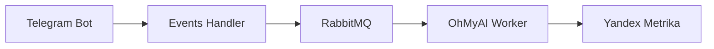

# Telegram to Metrika

Сервис для отправки данных о конверсиях из Telegram в Яндекс.Метрику через RabbitMQ.

## Архитектура

Проект состоит из нескольких микросервисов:

1. **Events Handler** - FastAPI сервис, который принимает события и отправляет их в RabbitMQ
2. **OhMyAI Worker** - Воркер для обработки событий регистрации на Workshow и отправки конверсий в Яндекс.Метрику
3. **RabbitMQ** - Брокер сообщений для асинхронной обработки событий

### Схема работы



## Установка и запуск

1. Клонировать репозиторий
2. Создать файл `.env` на основе `.env.example`
3. Запустить сервисы:

```bash
docker-compose up -d
```

## Конфигурация

Основные настройки в `.env`:
- `RABBITMQ_EXCHANGE` - название exchange в RabbitMQ
- `RABBITMQ_METRICS_QUEUE` - очередь для метрик
- `RABBITMQ_METRICS_ROUTING_KEY` - ключ маршрутизации
- `YANDEX_METRIKA_API_KEY` - API ключ Яндекс.Метрики
- `PROJECT_PORT` - порт для Events Handler

## API Endpoints

### Workshow Registration

```http
POST /workshow_register
```

Регистрирует конверсию для Workshow

Тело запроса:
```json
{
    "username": "string",
    "payload": "ymclid__123__yclid__456",
    "phone": "number",
    "current_timestamp": "number"
}
```

## Разработка

### Структура проекта
```
├── events_handler/         # FastAPI сервис
├── ohmyai_workshow_worker/# Воркер для Workshow
├── scripts/               # Скрипты инициализации
└── docker-compose.yml     # Docker композиция
```

### Технологии
- Python 3.12
- FastAPI
- RabbitMQ
- Docker
- Pydantic
- aio-pika

## Логирование

Все сервисы используют стандартный модуль logging с настраиваемым уровнем через переменную окружения `LOGGING_LEVEL`.

## Мониторинг

RabbitMQ Management доступен на порту 15672 (default credentials: guest/guest) 