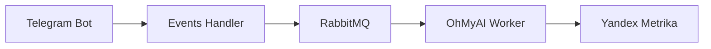

# Telegram to Metrika

Сервис для отправки данных о конверсиях из Telegram в Яндекс.Метрику через RabbitMQ.

## Быстрый старт

1. Клонировать репозиторий:
```bash
git clone <repository-url>
cd telegram_to_metrika
```

2. Создать файл `.env` на основе `.env.example`:
```bash
cp .env.example .env
```

3. Настроить переменные окружения в `.env`:
- Получить API ключ Яндекс.Метрики и указать в `YANDEX_METRIKA_API_KEY`
- Настроить параметры RabbitMQ (если отличаются от стандартных)
- Задать порт для API сервиса в `PROJECT_PORT`

4. Запустить сервисы:
```bash
docker-compose up -d
```

## Добавление нового проекта

Система спроектирована для поддержки множества проектов. Каждый проект имеет:
- Свой API endpoint
- Отдельную очередь в RabbitMQ
- Собственный воркер для обработки сообщений

### Важно: Связь компонентов

Ключевым моментом является согласованность routing keys между API endpoint и воркером:
1. В API endpoint указывается routing key для отправки сообщений
2. Воркер использует этот же routing key для получения сообщений
3. В `.env` этот ключ должен быть определен

Пример:
```env
OHMYAI_ROUTING_KEY=metrics.ohmyai  # Используется и в API, и в воркере
```

### 1. Создание API endpoint

За основу можно взять существующий пример: [ohmyai.py](events_handler/api/v1/ohmyai.py)

Ключевые моменты при создании endpoint:
```python
# Используйте тот же routing key, что настроен в .env
await queue_service.send_to_queue(
    message=request.model_dump(),
    routing_key=settings.your_project_routing_key  # Должен совпадать с воркером
)
```

### 2. Создание воркера

За основу рекомендуется взять существующий воркер: [worker.py](ohmyai_workshow_worker/worker.py)

При создании воркера нужно изменить:
1. Константы в начале файла:
```python
CONVERSION_TARGET = "your_conversion_name"  # Название события в Метрике
COUNTER_ID = "your_counter_id"  # ID счётчика Метрики
```

2. Метод parse_payload для вашей структуры данных:
```python
def parse_payload(self, payload: str) -> tuple[Optional[str], Optional[str]]:
    # Ваша логика извлечения ID из payload и возвращения ClientID и yclid
    pass
```

### 3. Настройка маршрутизации

В `.env` добавьте:
```env
YOUR_PROJECT_ROUTING_KEY=metrics.your_project  # Используется в API и воркере
```

## Архитектура

Проект состоит из нескольких микросервисов:

1. **Events Handler** - FastAPI сервис, который принимает события и отправляет их в RabbitMQ
2. **OhMyAI Worker** - Воркер для обработки событий регистрации на Workshow и отправки конверсий в Яндекс.Метрику
3. **RabbitMQ** - Брокер сообщений для асинхронной обработки событий

### Схема работы



## Конфигурация

### Основные настройки (.env)

- `RABBITMQ_EXCHANGE` - общий exchange для всех проектов
- `RABBITMQ_METRICS_QUEUE` - очередь для метрик
- `RABBITMQ_METRICS_ROUTING_KEY` - базовый ключ маршрутизации
- `YANDEX_METRIKA_API_KEY` - API ключ Яндекс.Метрики
- `PROJECT_PORT` - порт для Events Handler

### Настройки проектов

Для каждого проекта необходимо добавить:
- Routing key в формате `metrics.project_name`
- Очередь для проекта
- Специфические настройки проекта (при необходимости)

## API Endpoints

### Workshow Registration

```http
POST /workshow_register
```

Регистрирует конверсию для Workshow

Тело запроса:
```json
{
    "username": "string",
    "payload": "ymclid__123__yclid__456",
    "phone": "number",
    "current_timestamp": "number"
}
```

## Разработка

### Структура проекта
```
├── events_handler/         # FastAPI сервис
├── ohmyai_workshow_worker/# Воркер для Workshow
├── scripts/               # Скрипты инициализации
└── docker-compose.yml     # Docker композиция
```

### Технологии
- Python 3.12
- FastAPI
- RabbitMQ
- Docker
- Pydantic
- aio-pika

## Логирование

Все сервисы используют стандартный модуль logging с настраиваемым уровнем через переменную окружения `LOGGING_LEVEL`.

## Мониторинг

RabbitMQ Management доступен на порту 15672 (default credentials: guest/guest) 

## Примеры проектов

### OhMyAI Workshow

Полный пример реализации проекта:
- API endpoint: [ohmyai.py](events_handler/api/v1/ohmyai.py)
  - Маршрут: `/workshow/workshow_register`
  - Routing key: `metrics.ohmyai`
- Воркер: [worker.py](ohmyai_workshow_worker/worker.py)
  - Конверсия: `awst_workshow_register_offline`
  - Счётчик: `98979849`
- Настройки в `.env`:
  ```env
  OHMYAI_ROUTING_KEY=metrics.ohmyai
  ```

Этот проект демонстрирует базовую реализацию для отслеживания конверсий с параметрами ymclid и yclid. Его можно использовать как шаблон для создания новых проектов, изменив только специфичные параметры:
- Название конверсии
- ID счётчика
- Routing key
- Логику парсинга payload (если отличается) 
